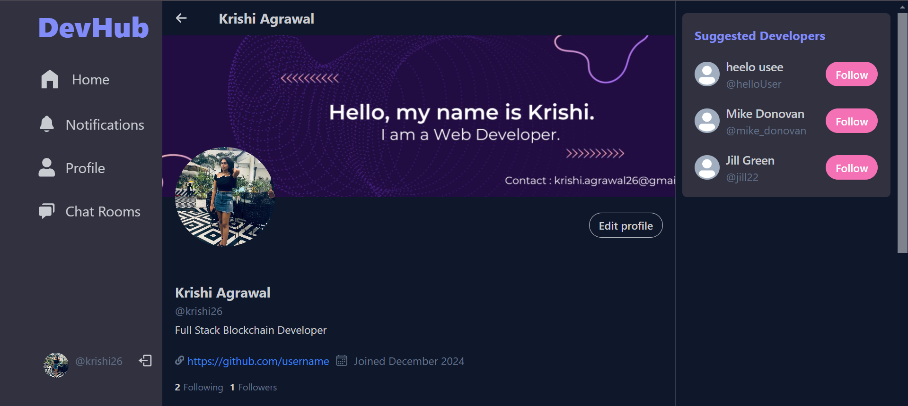
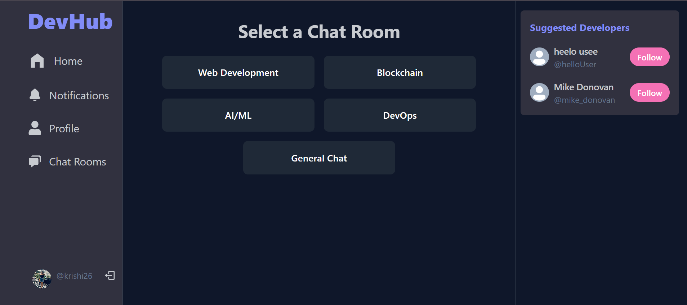

<div align="center">
    
    <h1> DevHub - A Developer's Hub </h1>
</div>

A community-driven platform for developers to connect, collaborate, and grow. Developers Hub serves as a social ecosystem where developers can share ideas, post updates, resolve doubts, and showcase their expertise.


## Key Features:
- **Post and Engage**: Share your latest work, ideas, or challenges with the community and engage with others through comments and reactions.
- **Developer Profiles**: Showcase your projects, social links, and achievements in a personalized developer profile.
- **Real-Time Chat**: Join specific chat rooms based on your interests (e.g., Web Development, AI/ML, Blockchain) and collaborate in real time.
- **Following & Personalized Feeds**: Follow other developers to see their updates in your "Following" feed, or explore global content in the "For You" feed.
- **Collaborative Tools**: Solve challenges together, message other developers, and build your professional network.


## Tech Stack:
### **Frontend**:
- React.js  
- TailwindCSS for a responsive and modern design.

### **Backend**:
- Node.js  
- Express.js for server-side logic.

### **Database**:
- MongoDB for seamless and scalable data management.

### **Authentication**:
- JWT-based secure login system.

### **File Storage**:
- Local/Cloud storage for uploading and managing user content.

### **Real-Time**:
- WebSockets for chat functionalities.

---

## How to Get Started:
1. **Clone the Repository**  
   ```bash
   git clone https://github.com/yourusername/developers-hub.git
   cd developers-hub

## Preview
- **Landing Page**
  
  <br/>
- **View Campaigns**
  
  <br/>
- **Detailed Camapaign Page**
  
  
  
  
